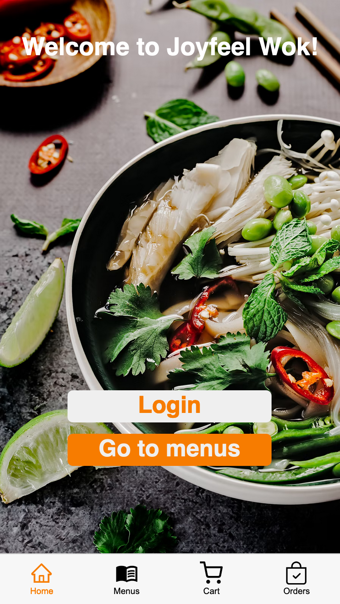
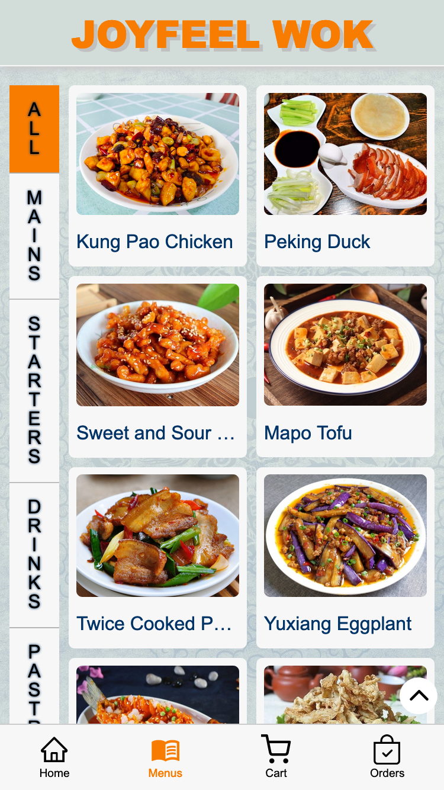
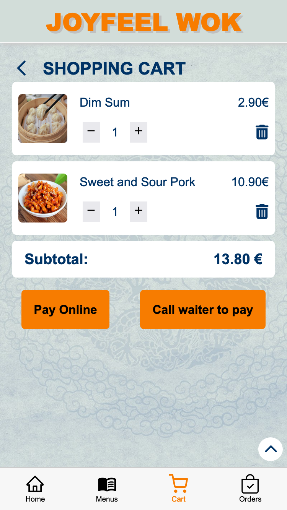
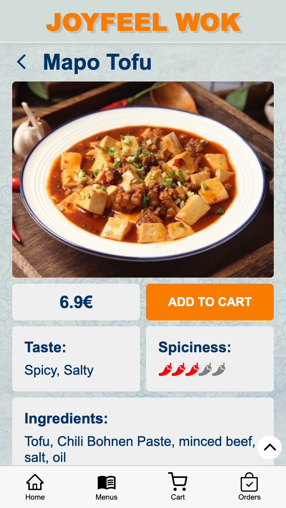
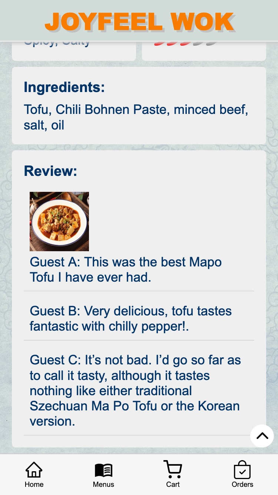
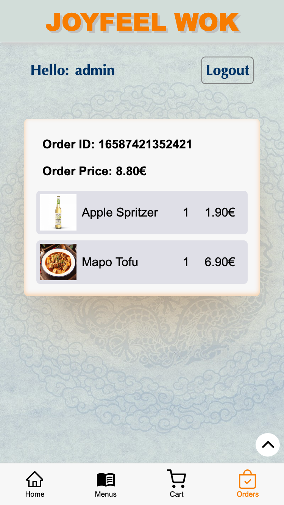
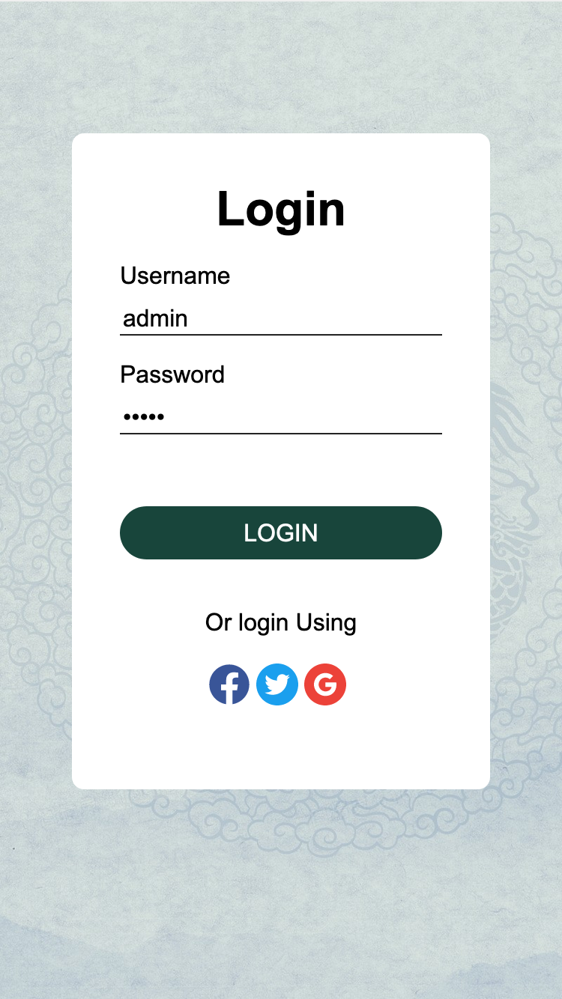
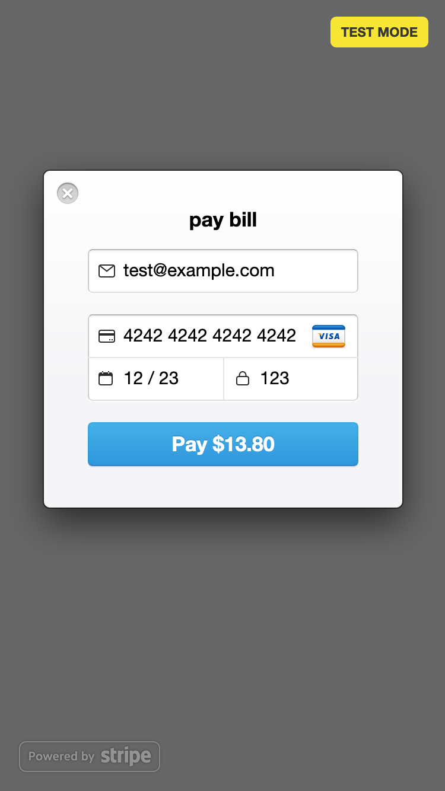

# Order your meal

I developed this App for my capstone project by neue fische Bootcamp.
I have been lived and travelled in different contries, there were always times that I was sitting in a restaurant and could not decide what for a dish I should order. Only the name of a dish reveals too little information to let me know what behind this name. Therefor I get the idea to develop a app to help customers in a restaurant to order meals more easily.

## Tech Stack

## Features

In my app, customers can

- login
- go through the menus
- and find details of every menu in detail page
- add menus to shopping cart
- call the waiter to pay or pay online(through Stripe)
- checked history orders if they have logged in

### Login

Now I have not finished sign up page for customers, login only works with username: admin, password:admin. Login information is stored in MongoDB Atlas.

### payment

Customers can pay their bill by calling the waiter, or pay online throught Stripe.
For testing, you can use the following information to finish the payment.

- email: any email, like abc@123.com
- card number: 4242424242424242
- date: any date that later than today, like 12/23
- CVC: any three numbers, like 123

## Plans for the future

- Finish sign up for users
- Sign up with facebook,twitter and google
- Comments in detail page can be edited, also fotos can be uploaded
- Store all informatio in MongoDB Atlas
